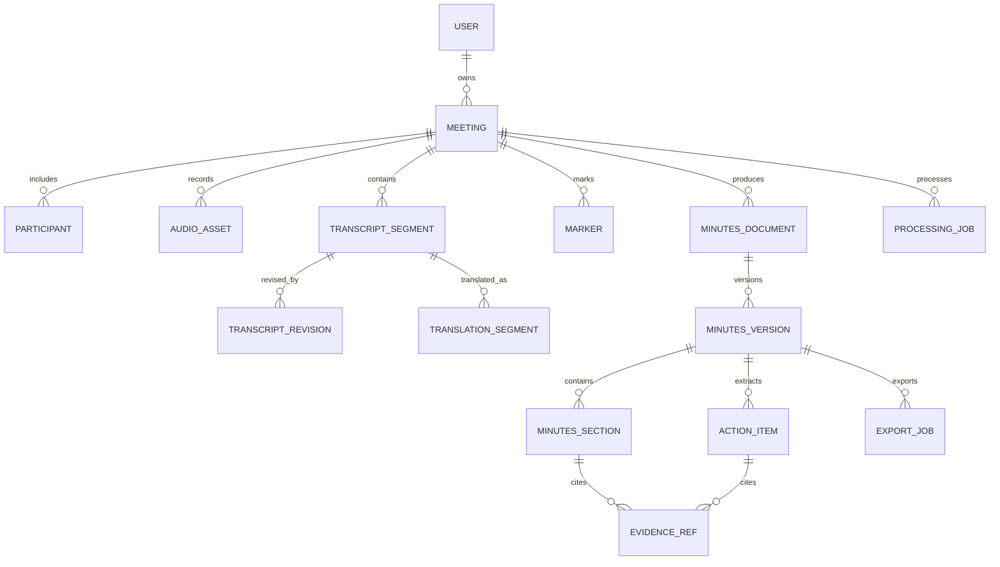

# Data Model and Integrity Rules

**Status:** Draft target model  
**Owner:** Engineering  
**Last reviewed:** 2026-07-21

## 1. Entity map

## 2. Core entities

### Meeting

Required fields: `id`, `ownerId`, `title`, `language(vi|en)`, `mode(meeting_only|meeting_translate)`, `captureSources`, `speechMode(api|local)`, `status`, `createdAt`, `startedAt`, `endedAt`, `timezone`, `version`.

- Language and mode cannot change after recording starts.
- `endedAt >= startedAt`.
- State updates use optimistic versioning.
- Translation target is derived; it is not arbitrary in alpha.

### AudioAsset

Fields: `id`, `meetingId`, `source`, `chunkIndex`, `storageKey`, `startedAt`, `durationMs`, `byteLength`, `codec`, `sampleRate`, `channels`, `sha256`, `uploadStatus`, `finalizedAt`.

- Unique `(meetingId, source, chunkIndex)`.
- Finalized content and checksum are immutable.
- Re-upload with the same ID/checksum is idempotent; a different checksum is rejected.

### TranscriptSegment

Fields: `id`, `meetingId`, `sequence`, `speakerId`, `language`, `text`, `startMs`, `endMs`, `confidence`, `source`, `provider`, `providerEventId`, `isGap`, `createdAt`.

- Source text is immutable.
- Unique provider event IDs prevent duplicates.
- `0 <= startMs < endMs <= meeting duration` unless `isGap` documents a recovery range.
- Sequence is stable after transcript finalization.

### TranscriptRevision

Fields: `id`, `segmentId`, `baseRevisionId`, `revisedText`, `revisedSpeakerId`, `actorId`, `reason`, `createdAt`.

A current transcript is a projection of immutable source segments plus selected revisions. Revisions never delete original provider output.

### TranslationSegment

Fields: `id`, `sourceSegmentId`, `targetLanguage`, `translatedText`, `provider`, `model`, `status`, `createdAt`. Translation versions are derived artifacts and require a source segment.

### MinutesDocument and MinutesVersion

`MinutesDocument` groups versions for a meeting/template. `MinutesVersion` records template, detail level, output language, provider, model, prompt version, transcript projection, completeness, creator, timestamp and immutable content snapshot.

### EvidenceRef

Fields: `segmentId`, `startMs`, `endMs`, optional `quoteHash`.

- Segment belongs to the same meeting.
- Time range lies within the segment/audio duration.
- References cannot target interim or deleted derived content.
- Optional quote hash detects source/revision mismatch in exports.

## 3. Data classes

| Class | Examples | Mutability | Retention |
|---|---|---|---|
| Source evidence | Finalized audio, source transcript | Append/finalize then immutable | Until user deletion/policy expiry |
| Corrective history | Transcript revisions, speaker mappings | Append-only | Same as meeting |
| Derived artifacts | Translation, minutes, exports | Versioned/recreatable | User controlled |
| Operational metadata | Jobs, upload attempts, safe errors | Mutable state + event history | Shorter operational policy |
| Secrets | Provider keys, signing keys | Rotatable | Secret manager policy |

## 4. Deletion lifecycle

1. Soft delete hides the meeting and records `deletedAt`.
2. Recovery window preserves all artifacts.
3. Permanent deletion creates a deletion job and tombstone.
4. Database rows and object keys are removed idempotently.
5. Backups age out according to documented retention.
6. Completion is recorded without retaining meeting content.

## 5. Migration rules

- Use ordered migrations and backward-compatible deploy sequencing.
- Add nullable/defaulted fields before clients depend on them.
- Backfills are resumable and audited by counts, not content logs.
- Destructive migrations require backup verification and rollback/restore.
- Prompt/schema versions remain resolvable for historical minutes.
