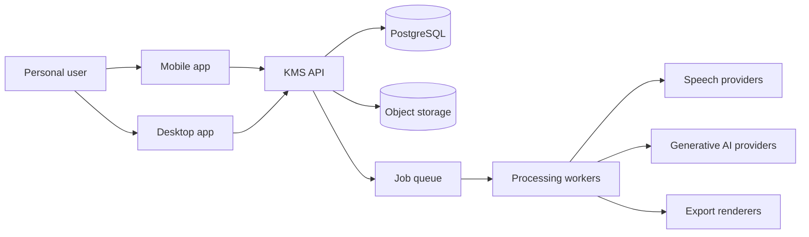
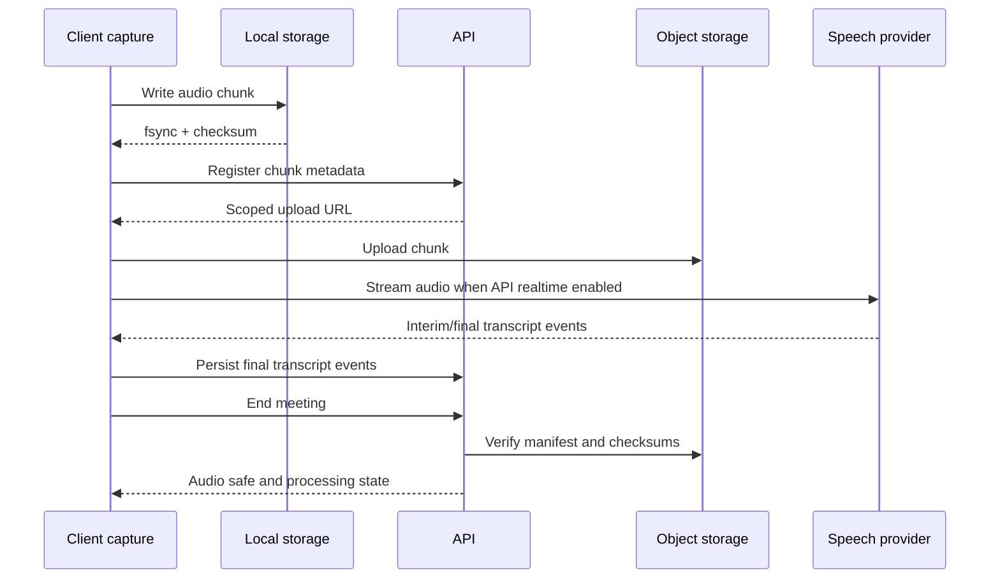

# System Architecture

**Status:** Draft target architecture  
**Owner:** Engineering  
**Last reviewed:** 2026-07-21

## 1. Architectural drivers

- Recording must survive network and process failures.
- Original evidence must be immutable and independently verifiable.
- Mobile and desktop share a domain model but use platform-specific capture.
- Realtime UI and long-running processing require different execution paths.
- Speech and generative AI providers must be replaceable independently.
- User content and provider credentials require strict server-side boundaries.

## 2. Context

## 3. Component boundaries

### Clients

- **Mobile:** microphone capture, local manifest/chunks, offline upload queue, meeting controls, transcript viewer and lightweight edits.
- **Desktop UI (Electron/React):** window/update lifecycle, full transcript review, TipTap minutes editor, branding and export controls.
- **Desktop native runtime (Rust):** WASAPI/microphone capture, stable device identity/health, persistent resampling, bounded buffers, local chunk durability and the verified default local final-STT engine.
- Neither client receives third-party provider secrets.

### API

- Authenticates users and authorizes every meeting/artifact operation.
- Owns meeting state transitions and idempotency.
- Issues scoped upload URLs, records chunk manifests and verifies completion.
- Exposes durable resources via REST and live state via SSE/WebSocket.
- Enqueues expensive work instead of holding requests open.

### Workers

- Audio finalization and integrity verification.
- Speech streaming/session adapters and file backfill.
- Translation, diarization reconciliation and completeness checks.
- Detailed minutes generation and citation validation.
- Document/audio export.

### Desktop native boundary

- IPC schemas are versioned and runtime validated on both TypeScript and Rust sides.
- Commands/events are allowlisted; the renderer has no arbitrary filesystem/process capability.
- Microphone and system audio remain separate immutable source tracks aligned to one monotonic timeline.
- A derived mix may feed playback/transcription, but VAD/mixing never deletes source evidence.
- Stable OS endpoint IDs, device hot-plug, Bluetooth grace and sleep/wake are first-class events.
- Bounded buffers expose overruns as timeline gaps and metrics instead of silently consuming unbounded memory.
- Native runtime crash/restart is supervised through the Recovery Inbox and finalized-chunk manifest.

### Storage

- PostgreSQL: users, meetings, state, manifests, transcript segments/revisions, translations, minutes versions, jobs and audit metadata.
- Object storage: audio chunks, finalized audio, logos and exports.
- Local client database: active-session manifest, upload queue, cached metadata and recovery state.

## 4. Recording data flow

The local write acknowledgement follows durable write plus atomic manifest update and precedes upload. A chunk ID is stable across retries. Server registration and completion are idempotent.

## 5. Processing flow

1. Finalize validates chunk sequence, duration and checksum.
2. Missing realtime ranges create a backfill transcription job.
3. Transcript completeness is calculated; gaps remain explicit.
4. Diarization/speaker reconciliation finishes before official minutes unless the user accepts partial data.
5. Minutes generation uses a fixed transcript projection/revision set.
6. Schema and evidence validators run before the version becomes reviewable.
7. Export renders a specific immutable minutes version.

## 6. State and consistency

Meeting transitions are enforced server-side:

`draft → checking → recording ↔ paused → finalizing → processing → ready`

Recovery branches: `recording|paused → recovery_required`; recoverable processing failures produce `partial_ready`.

- Optimistic UI may display a requested transition, but server state is authoritative.
- State-changing requests use idempotency keys.
- Jobs use at-least-once delivery and idempotent handlers.
- Database transactions commit state plus outbox events together.
- Consumers deduplicate by event/job ID.

## 7. Security boundaries

- Client identity tokens are distinct from provider credentials.
- Object access uses short-lived, meeting-scoped signed URLs.
- Workers receive only the meeting data required for one job.
- Logs contain IDs, durations and status—not user content.
- Provider routing checks user/provider policy before content leaves the service.

## 8. Technology defaults

| Area     | Default                                               | Reason                                                  |
| -------- | ----------------------------------------------------- | ------------------------------------------------------- |
| Mobile   | Expo / React Native                                   | Shared TypeScript and broad device reach                |
| Desktop  | Electron / React + signed Rust runtime, Windows first | Mature editor UI plus native audio/local-AI performance |
| API      | Fastify / TypeScript                                  | Lightweight typed service aligned with repo             |
| Database | PostgreSQL                                            | Transactions, relational integrity and JSON support     |
| Objects  | S3-compatible storage                                 | Large immutable objects and signed access               |
| Queue    | Durable Redis-backed or managed queue                 | Retries, progress and worker separation                 |
| Realtime | SSE for server progress; provider socket for speech   | Simple reconnect semantics for app state                |

Specific cloud vendors remain deployment decisions; interfaces must not depend on proprietary database behavior.

## 9. Evolution

- Personal alpha runs as a modular monolith plus workers.
- Split services only when independent scaling, ownership or failure isolation is demonstrated.
- Team/RBAC, calendar integrations and enterprise controls are future bounded contexts, not alpha dependencies.

## 10. Local-first final transcription flow

1. End pins an immutable verified audio-manifest version.
2. The versioned policy selects exactly one primary final path: none, desktop local or consented cloud. Missing desktop/model produces a truthful waiting state, not cloud fallback.
3. Local final creates deterministic bounded overlapped windows and durable per-part checkpoints.
4. Cloud final uses one full-meeting batch when supported or equivalent deterministic windows within the same consented provider and scope.
5. Immutable raw run events reconcile into a versioned projection; each expected range becomes canonical text or an explicit gap.
6. Local-plus-cloud-check creates a separate cloud run only after local completion and exact user approval. It cannot replace the projection without a review decision.
7. Translation and minutes consume a fixed authoritative transcript projection/revision set.

PostgreSQL stores transcription policies, immutable runs/parts/raw events, projections and revisions. The Windows Rust runtime owns the verified default local file-STT engine with bounded resources and capture priority. Mobile audio may remain `waiting_for_desktop` until an authorized desktop processes its durable synchronized manifest.

Local STT, local-only storage, synchronized local STT, cloud speech and cloud minutes AI are separate trust and consent boundaries.
