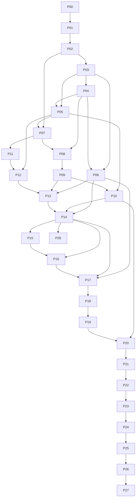

# Master Execution Plan

**Status:** Accepted
**Production target:** Personal-use cloud-synced release for Windows and Android
**Optional extension:** P28 advanced model lifecycle, mobile/local-live speech, and immutable audio import
**Last reviewed:** 2026-07-21

## Release trains

| Train                    | Phases  | Exit condition                                                                                                              |
| ------------------------ | ------- | --------------------------------------------------------------------------------------------------------------------------- |
| Decision closure         | P00     | Product, platform, capture, privacy, provider, and baseline decisions are traceable.                                        |
| Trusted foundation       | P01-P07 | Deterministic quality gates and durable, owner-ready data/storage/recovery primitives are verified.                         |
| Reliable capture clients | P08-P12 | Mobile and Windows capture recover without silent source loss on supported devices.                                         |
| Evidence pipeline        | P13-P16 | Cloud live, desktop local final, final-run reconciliation, translation and provenance review remain complete and immutable. |
| Derived intelligence     | P17-P20 | Validated detailed minutes, editing, branding, export, and library workflows are feature-complete.                          |
| Production qualification | P21-P27 | Security, privacy, operations, resilience, deployment, signing, rollout, and support evidence pass.                         |
| Optional extension       | P28     | Mobile local, qualified local live, advanced models and imported audio reuse the same immutable evidence pipeline.          |

P20 is feature-complete, not production-ready. P27 is the only phase allowed to mark the personal release `RELEASED`. P28 is optional and must not delay or weaken P27.

## Canonical direct dependency graph

Only the direct dependencies above belong in phase frontmatter and `PROGRESS.md`. A transitive requirement may be reviewed in a phase gate without being repeated as a dependency.

## Phase catalog

| Phase                                            | Outcome                                                                          | Direct dependencies | Risk     |
| ------------------------------------------------ | -------------------------------------------------------------------------------- | ------------------- | -------- |
| [P00](phases/P00-design-closure.md)              | Close design defaults and establish traceable repository baseline                | -                   | High     |
| [P01](phases/P01-quality-foundation.md)          | Deterministic scripts, tests, CI, typed config, and service harness              | P00                 | High     |
| [P02](phases/P02-domain-contracts.md)            | Canonical runtime schemas, state machine, errors, commands, and events           | P01                 | Critical |
| [P03](phases/P03-persistence.md)                 | PostgreSQL migrations and integrity-preserving repositories                      | P02                 | Critical |
| [P04](phases/P04-auth-authorization.md)          | Personal OIDC/PKCE identity and owner-scoped authorization                       | P03                 | Critical |
| [P05](phases/P05-object-storage-chunks.md)       | Immutable S3 chunk protocol, signed URLs, and manifest reconciliation            | P03, P04            | Critical |
| [P06](phases/P06-jobs-outbox-events.md)          | Durable jobs, transactional outbox, cancellation, and resumable SSE              | P03, P04            | Critical |
| [P07](phases/P07-local-recovery-engine.md)       | Atomic local manifest, bounded upload queue, and recovery engine                 | P02, P05            | Critical |
| [P08](phases/P08-mobile-start-flow.md)           | Mobile authentication, versioned speech policy, readiness, consent, localization | P04, P07            | High     |
| [P09](phases/P09-mobile-recording.md)            | Android local-first microphone recording lifecycle                               | P08                 | Critical |
| [P10](phases/P10-mobile-sync-recovery.md)        | Mobile sync, Recovery Inbox, library, and evidence playback                      | P05, P09            | Critical |
| [P11](phases/P11-desktop-rust-foundation.md)     | Secure Electron shell and versioned supervised Rust runtime                      | P07                 | Critical |
| [P12](phases/P12-windows-audio-capture.md)       | Windows microphone/system capture with separate durable tracks                   | P05, P11            | Critical |
| [P13](phases/P13-speech-deepgram.md)             | Provider-neutral cloud-live and desktop local-file speech platform               | P06, P09, P12       | High     |
| [P14](phases/P14-finalization-backfill.md)       | Finalization, mutually exclusive final runs, reconciliation, and completeness    | P06, P10, P13       | Critical |
| [P15](phases/P15-translation.md)                 | Versioned Vietnamese-English derived translation                                 | P14                 | High     |
| [P16](phases/P16-transcript-review.md)           | Transcript provenance, local/cloud comparison, revisions, and evidence review    | P14, P15            | High     |
| [P17](phases/P17-ai-provider-platform.md)        | Capability-based generative provider platform and validation                     | P06, P14, P16       | Critical |
| [P18](phases/P18-detailed-minutes-evaluation.md) | Five evidence-linked minutes templates and fixed evaluation gates                | P17                 | Critical |
| [P19](phases/P19-minutes-editor.md)              | Structured minutes editor, autosave, version history, and rewrite proposals      | P18                 | High     |
| [P20](phases/P20-branding-export-library.md)     | Branding, reproducible exports, and complete meeting library                     | P10, P19            | High     |
| [P21](phases/P21-application-security.md)        | Application, native-boundary, and supply-chain security hardening                | P20                 | Critical |
| [P22](phases/P22-privacy-deletion-governance.md) | Consent, disclosure, retention, deletion, and backup-aging governance            | P21                 | Critical |
| [P23](phases/P23-observability-support.md)       | Content-free telemetry, SLOs, alerts, support, and incident exercises            | P22                 | High     |
| [P24](phases/P24-resilience-performance-a11y.md) | Long-session, fault, performance, accessibility, and localization qualification  | P23                 | Critical |
| [P25](phases/P25-deployment-backup-dr.md)        | Staging/production delivery, migrations, backup, restore, and disaster recovery  | P24                 | Critical |
| [P26](phases/P26-packaging-signing-updates.md)   | Signed desktop/mobile artifacts and controlled updates                           | P25                 | Critical |
| [P27](phases/P27-production-qualification.md)    | Full release matrix, beta rollout, monitoring, and production handoff            | P26                 | Critical |
| [P28](phases/P28-local-ai-import-extension.md)   | Optional mobile/local-live/model-lifecycle and immutable audio import            | P14                 | High     |

## Phase sizing rule

Each packet is sized for one sustained agent conversation. It may contain several task packets and subagents, but it must retain one integrated outcome and one phase gate. Split a phase only through a reviewed master-plan change when independent outcomes, non-overlapping release gates, and a real dependency boundary exist; never create hidden sub-phases to claim partial completion.

## Release rules

- Direct dependencies default to `VERIFIED` before a phase enters `IN_PROGRESS`.
  A packet may explicitly consume an `IMPLEMENTED` dependency capability only
  through the evidence-linked, orthogonal-gate rules in `EXECUTION_PROTOCOL.md`.
- P00-P20 deliver feature-complete personal behavior.
- P21-P27 convert feature completeness into production qualification; none may be skipped.
- P27 re-runs the full critical matrix and cannot rely solely on earlier evidence.
- P28 has a separate optional release decision, reuses P13/P14 contracts, and cannot change source-evidence rules.
- A phase advances only from direct artifacts recorded under `docs/execution/evidence/Pxx/`.
