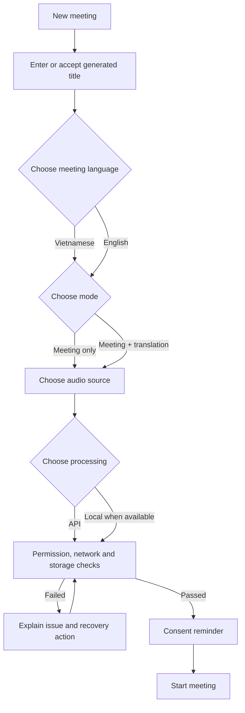
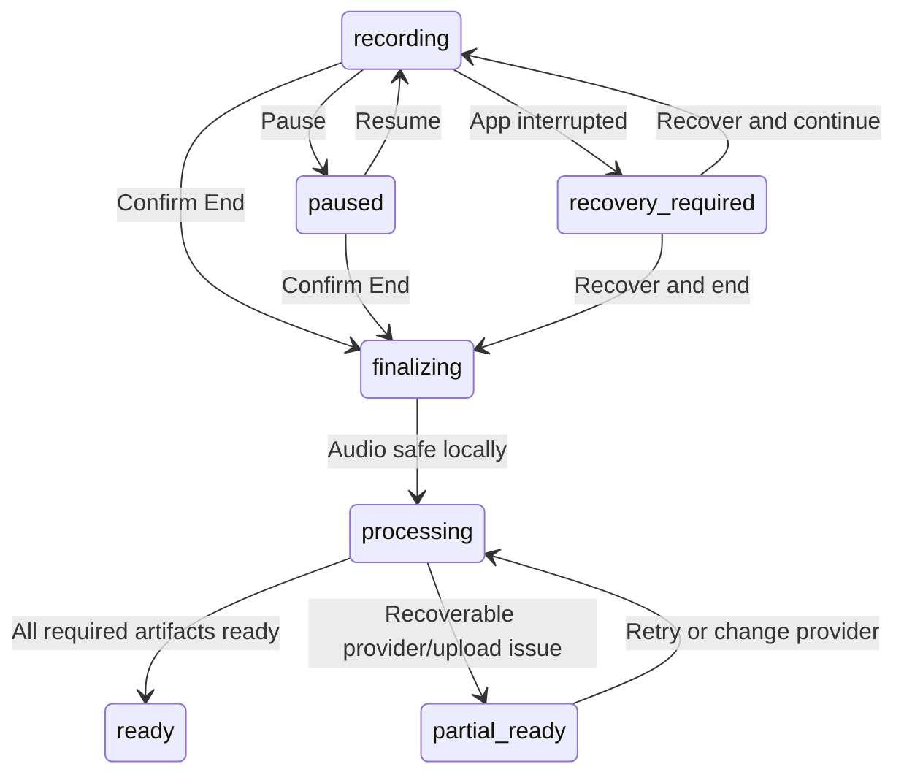

# User Flows

**Status:** Draft  
**Owner:** Product Design  
**Last reviewed:** 2026-07-21

## 1. Start a meeting

Start is disabled until language, mode, source and required permissions are valid. Translation direction is automatic: Vietnamese meetings translate to English; English meetings translate to Vietnamese.

## 2. Live meeting

The primary surface prioritizes capture health over AI output:

1. Recording indicator and duration.
2. Microphone/system-audio meters.
3. Pause and End controls.
4. Storage/network/provider warnings.
5. Final transcript stream, followed by interim text.
6. Translation pane only when enabled.
7. Marker control for important moments.

Pause finalizes the current chunk. Resume begins the next chunk and inserts a visible pause interval. End uses a confirmation sheet with current duration and upload status.

## 3. End and process

The completion view separates:

- **Audio safety:** locally finalized, upload pending or cloud verified.
- **Transcript:** live final, backfill pending, complete or has marked gaps.
- **Diarization:** pending, complete or unavailable.
- **Translation:** not requested, processing, complete or partial.

Minutes are not silently generated. The user chooses a template and output language after reviewing processing status.

## 4. Transcript review

- Play/pause follows the highlighted segment.
- Selecting a segment seeks audio to its start timestamp.
- Rename a speaker across the meeting; merging speakers requires confirmation.
- Editing creates a revision and shows original text on demand.
- A gap is shown as a timeline object, not removed or hidden.
- Search results display speaker, timestamp and source/revised state.

## 5. Create and edit minutes

1. Choose one of the five templates.
2. Confirm output language and `Detailed` or `Near-verbatim` level.
3. Choose AI provider only when advanced provider selection is enabled; otherwise use the account default.
4. Review generation progress and data-completeness warning.
5. Open editor with citations and `Needs confirmation` items visible.
6. Resolve uncertain owners/deadlines/decisions.
7. Apply brand preset and document settings.
8. Save a named version and export.

AI rewrite opens a proposal/diff. Rejecting it leaves the document unchanged. Regeneration never overwrites a version.

## 6. Failure and recovery

| Situation                    | User experience                                     | Data behavior                                   |
| ---------------------------- | --------------------------------------------------- | ----------------------------------------------- |
| Network lost while recording | Persistent offline banner; recording remains active | Local chunks queue for upload                   |
| Speech provider unavailable  | Transcript marked delayed                           | Audio continues; backfill job is created        |
| Low storage                  | Early warning with estimated remaining time         | Finalize current chunk before capture must stop |
| App terminated               | Recovery screen on next launch                      | Manifest identifies finalized and open chunks   |
| Upload checksum mismatch     | Chunk marked retry required                         | Server rejects corrupt/duplicate content        |
| AI output invalid            | Minutes job fails with retry/change-provider action | Transcript and earlier minutes remain unchanged |
| Export fails                 | Export job can be retried                           | Selected minutes version remains intact         |

## 7. Destructive actions

- End meeting requires confirmation but remains easy to access.
- Delete meeting first moves it to Recently Deleted.
- Permanent delete clearly lists audio, transcript, minutes and exports affected.
- Changing provider warns when meeting content will be sent to a new third party.

## 8. Local-first transcription choices

The processing step uses independent live and final choices:

1. Live is off by default. Enabling cloud live names the provider and requests consent before streaming derived audio.
2. Final defaults to **Create transcript on this computer after the meeting**.
3. **Create transcript with cloud after the meeting** is a mutually exclusive primary final choice.
4. **Create locally, then check approved difficult parts with cloud** completes local first, presents suggested or manually selected ranges, provider and estimated usage, then requests exact approval.
5. **Record only** finalizes audio without creating a transcript run.

A missing desktop/model produces `waiting_for_desktop` or `waiting_for_model`; recording remains available. Local final resumes deterministic overlapped processing windows independently. Cloud final prefers a full-meeting batch when provider limits permit and otherwise uses equivalent windows without changing provider or approved scope.

Transcript review shows local/cloud provenance, preserves every raw alternative, highlights material disagreements and seeks each alternative to the exact audio range. Confirming local, cloud or a manual correction creates a versioned projection decision and never overwrites raw runs.
